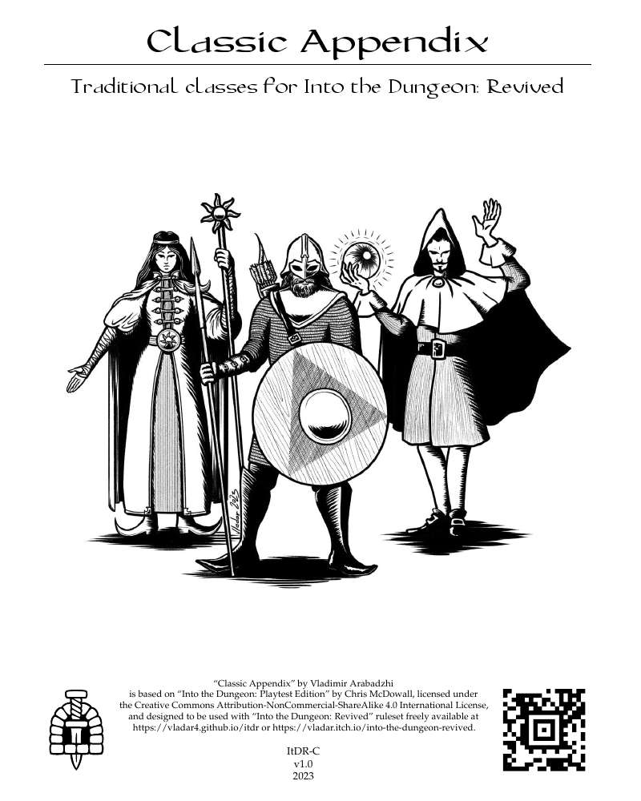

ItDR - Classic Appendix
=======================

Prior to version 2.0 of [Into the Dungeon: Revived](https://vladar4.github.io/itdr/), it contained the “Appendix C: Class-ic Edition” — a remnant of the “Playtest Edition” predecessor that instead of the Features and Backgrounds of ItDR had three classes: Warrior, Mystic, and Disciple. Since version 2.0, Appendix C was removed.

This supplement is meant for those who want to include these classes in their ItDR games.

PDFs
----
All PDFs are located in the "current" directory.

| PDF file                   | Description                                             |
|----------------------------|---------------------------------------------------------|
| itdr-classic.pdf           | current version of the document                         |
| itdr-classic_booklet.pdf   | booklet for printing                                    |
| itdr-classic_booklet_r.pdf | booklet for printing with odd pages rotated upside down |

Printing
--------
* Page setup:
  * for `*_booklet.pdf`: Two-sided - short edge (flip)
  * for `*_booklet_r.pdf`: Two-sided - long edge (standard)
* Page scaling: `none`
* Auto rotate and center: `yes`
* Trim printed booklets to about 5.4in x 8in.

Scripts
-------
| Script                         | Description                                                                                                               |
|--------------------------------|---------------------------------------------------------------------------------------------------------------------------|
| cleanup.sh                     | clean auxiliary files                                                                                                     |
| make_all.sh                    | update ALL PDFs in the repository                                                                                         |
| make_base.sh                   | make base document                                                                                                        |
| make_booklet.sh [-r] [FILE]... | make specified booklets, "-r" key to rotate odd pages upside down (see in-script options and comments for more info) |
| make_booklets.sh               | make all booklets including ones with upside down odd pages (with suffix "_r")                                            |

Dependencies
------------
[TeX Live](https://www.tug.org/texlive/)

### Arch
`sudo pacman -S texlive-bin texlive-binextra texlive-basic texlive-plaingeneric texlive-fontsrecommended texlive-fontsextra texlive-latex texlive-latexrecommended texlive-latexextra`

### Debian
`sudo apt-get install texlive-latex-base texlive-fonts-extra texlive-latex-extra`

Changelog
---------

### v1.0
Initial release.

